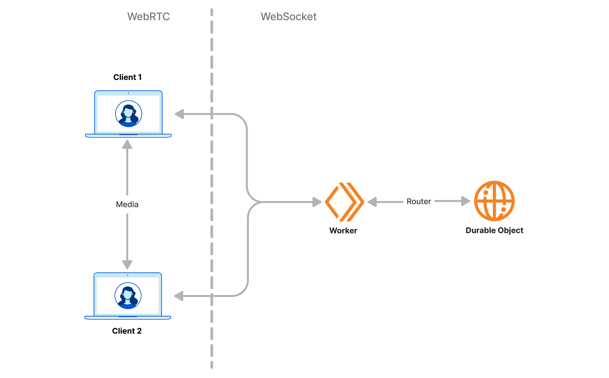
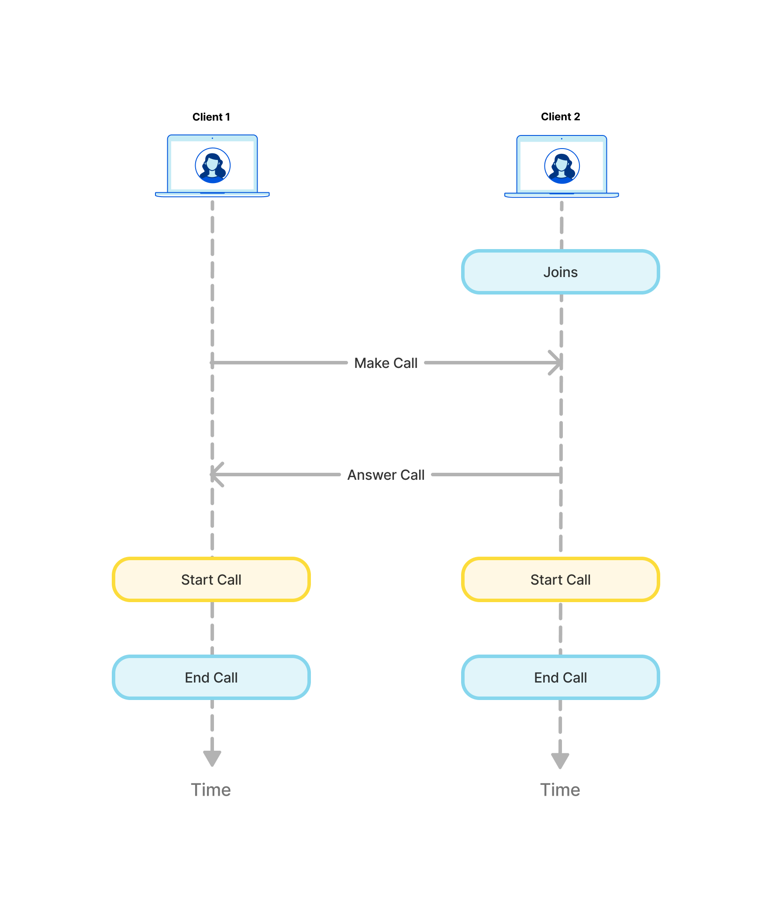

# Veet

A video call app built with [Cloudflare Pages](https://developers.cloudflare.com/pages/) and [Durable Objects](https://developers.cloudflare.com/durable-objects/).

## Video tutorials 

- [Build a Video Call App with Durable Objects](https://www.youtube.com/playlist?list=PLzfTyn6__SjgC2ty1_BAl0RGgr2jKjngz)

## How It Works


Peer to peer connection for video and audio stream is delivered over [WebRTC](https://developer.mozilla.org/en-US/docs/Web/API/WebRTC_API). Peer discovery and signalling is powered by [WebSockets](https://developer.mozilla.org/en-US/docs/Web/API/WebSocket) over [Durable Objects](https://developers.cloudflare.com/durable-objects/api/websockets/).

The diagram below explains how signalling over WebSocket happens on the frontend


# Local Setup
Clone the repo
```sh
git clone https://github.com/megaconfidence/veet.git
```
Install the client dependencies and start a local dev server
```sh
cd client
npm i
npm start #available on http://localhost:8788
```
Install the server dependencies and start a local dev server
```sh
cd server
npm i
npm start #available on ws://localhost:8787
```
To deploy either the client or server, run the following the corresponding directory
```sh
npm run deploy
```
Once the server is deployed, update `env.ws` in [`client/public/call/index.js`](https://github.com/megaconfidence/veet/blob/bb50f00158571b8ab2fa755f8e33476941ee393d/client/public/call/index.js#L12) to the deployed server address.

