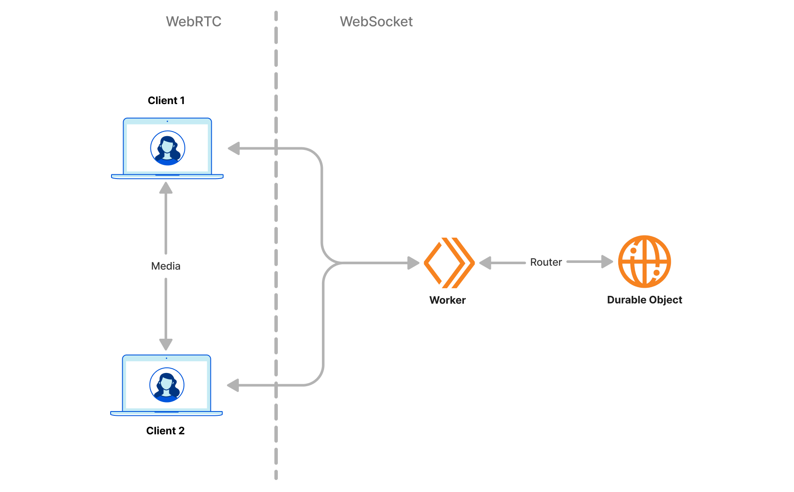
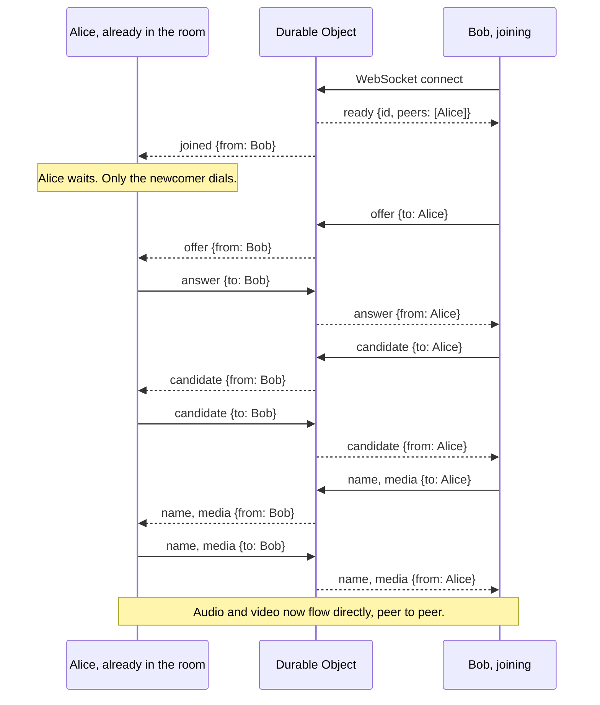

# Veet

A video call app built on a single [Cloudflare Worker](https://developers.cloudflare.com/workers/), combining [static assets](https://developers.cloudflare.com/workers/static-assets/) and [Durable Objects](https://developers.cloudflare.com/durable-objects/).

[](https://deploy.workers.cloudflare.com/?url=https://github.com/megaconfidence/veet)

Deploying clones the repo into your own GitHub account and provisions the Durable Object
for you. The two TURN secrets are optional — leave them blank and Veet runs on STUN.

## Video tutorials

- [Build a Video Call App with Durable Objects](https://www.youtube.com/playlist?list=PLzfTyn6__SjgC2ty1_BAl0RGgr2jKjngz)

> The series was recorded when Veet was split across a Pages project and a separate
> signalling Worker, and when calls were limited to two people. It is now a single
> Worker with a full mesh, so the layout and some of the client code differ from the
> videos.

## How it works



Audio and video travel directly between browsers over
[WebRTC](https://developer.mozilla.org/en-US/docs/Web/API/WebRTC_API). The Worker only
handles discovery and signalling, over
[WebSockets](https://developer.mozilla.org/en-US/docs/Web/API/WebSocket) held open by a
[Durable Object](https://developers.cloudflare.com/durable-objects/api/websockets/).
No media ever passes through Cloudflare.

### What the Worker serves

| Request            | Handled by                                       |
| ------------------ | ------------------------------------------------ |
| `/ws/<meeting-id>` | A Durable Object, one instance per meeting       |
| `/ice`             | The Worker, minting short-lived TURN credentials |
| everything else    | Static assets in [`public/`](./public)           |

Because the frontend and the signalling endpoint share an origin, the client derives its
WebSocket URL from `location` — there is no backend address to configure.

### A full mesh

Every participant holds one `RTCPeerConnection` per other participant. That keeps media
peer-to-peer with no server in the path, at the cost of each person uploading their
stream once per peer — comfortable up to roughly four or five people. Beyond that you
would want an SFU.

### Signalling

Messages carrying a `to` field are delivered to that one peer; everything else fans out
to the room. On connect the Durable Object snapshots the roster **before** registering
the newcomer, then hands it over. Only the newcomer dials out, so two peers can never
send each other an offer at the same time — glare is ruled out by the topology rather
than by tie-breaking.


```mermaid
sequenceDiagram
    participant A as Alice, already in the room
    participant DO as Durable Object
    participant B as Bob, joining

    B->>DO: WebSocket connect
    DO-->>B: ready {id, peers: [Alice]}
    DO-->>A: joined {from: Bob}
    Note over A: Alice waits. Only the newcomer dials.

    B->>DO: offer {to: Alice}
    DO-->>A: offer {from: Bob}
    A->>DO: answer {to: Bob}
    DO-->>B: answer {from: Alice}

    B->>DO: candidate {to: Alice}
    DO-->>A: candidate {from: Bob}
    A->>DO: candidate {to: Bob}
    DO-->>B: candidate {from: Alice}

    B->>DO: name, media {to: Alice}
    DO-->>A: name, media {from: Bob}
    A->>DO: name, media {to: Bob}
    DO-->>B: name, media {from: Alice}

    Note over A,B: Audio and video now flow directly, peer to peer.
```

| Message                    | Direction       | Purpose                           |
| -------------------------- | --------------- | --------------------------------- |
| `ready` `{id, peers}`      | server → joiner | Your session id plus the roster   |
| `joined` / `left` `{from}` | server → room   | Someone arrived or dropped        |
| `offer` / `answer` `{to}`  | peer → peer     | Session negotiation               |
| `candidate` `{to}`         | peer → peer     | Trickled ICE                      |
| `media` `{kind, enabled}`  | peer → room     | Mute / camera state for the tiles |
| `name` `{name}`            | peer → room     | Display name for the tiles        |

The Durable Object relays whatever it is given and only inspects `to`, so `media` and
`name` needed no server support — peers introduce themselves directly once their
connection is up. Candidates that arrive before the remote description is set are queued
and flushed, which is routine with trickled ICE.

## Chat

Messages travel over a [WebRTC data
channel](https://developer.mozilla.org/en-US/docs/Web/API/RTCDataChannel), not the
signalling socket, so chat is as peer-to-peer as the video and never reaches Cloudflare.
Nothing is stored on either end: reload the page and the conversation is gone.

Adding a data channel to a live connection would normally force a renegotiation. It does
not here, because of the same rule that avoids glare — only the newcomer dials. The
newcomer calls `createDataChannel()` **before** `createOffer()`, so the `m=application`
section is in the very first offer and the answering peer picks it up through
`ondatachannel`. Each pair of participants ends up with exactly one offer and one answer,
data channel included.

## Names and devices

A shared settings dialog ([`public/shared/`](./public/shared)) is reachable from the
lobby and from the call control bar. It sets a display name, microphone, camera, and —
where the browser supports `setSinkId` — the speaker. All four are remembered in
`localStorage`, so they carry over to the next call. Peers who never set a name show up
as `Guest 1`, `Guest 2`, and so on.

Switching a device mid-call uses
[`RTCRtpSender.replaceTrack()`](https://developer.mozilla.org/en-US/docs/Web/API/RTCRtpSender/replaceTrack)
on every peer connection. That changes the outgoing media behind the sender without
touching the SDP, so nobody has to renegotiate and the call never drops. The new track
inherits the old one's mute state. If a device is unplugged its track fires `ended`, and
the client falls back to whatever is still attached.

## Project layout

```
src/index.js       Worker entry: the signalling Durable Object, /ice, and the asset fallback
public/
  index.html       Lobby — create or join a meeting
  style.css
  call/            The call page: tile grid, controls, mesh client, chat panel
  shared/          Settings dialog, device enumeration, stored preferences
  images/
wrangler.jsonc     Assets, Durable Object binding, and its SQLite-backed export
```

## Local setup

Clone the repo and install dependencies

```sh
git clone https://github.com/megaconfidence/veet.git
cd veet
npm i
```

Start a local dev server

```sh
npm start #available on http://localhost:8787
```

Open the same meeting link in two tabs to place a call.

## TURN credentials

Without a TURN key the app falls back to STUN only, which is fine locally and on most
home networks, but fails behind symmetric NAT and restrictive firewalls. To enable TURN,
create a key on the [Cloudflare Realtime dashboard](https://dash.cloudflare.com/?to=/:account/calls)
and set both values as secrets

```sh
npx wrangler secret put TURN_KEY_ID
npx wrangler secret put TURN_KEY_API_TOKEN
```

For local development, copy [`.env.example`](./.env.example) to `.env` (already
gitignored) and fill in the same values

```sh
cp .env.example .env
```

Secrets set with `wrangler secret put` live on Cloudflare, per Worker and per account.
`.env` is only ever read by `wrangler dev` — it is never uploaded — so a fresh account
needs its own `secret put` runs.

> If a `.dev.vars` file exists it wins and `.env` is ignored, with no warning about the
> conflict. Your only tell is the `Using secrets defined in …` line that `wrangler dev`
> prints on startup — check it names `.env`, and delete any leftover `.dev.vars`.

The long-term key stays on the server. `/ice` exchanges it for credentials that expire
after two hours.

## Deploy

```sh
npm run deploy
```
