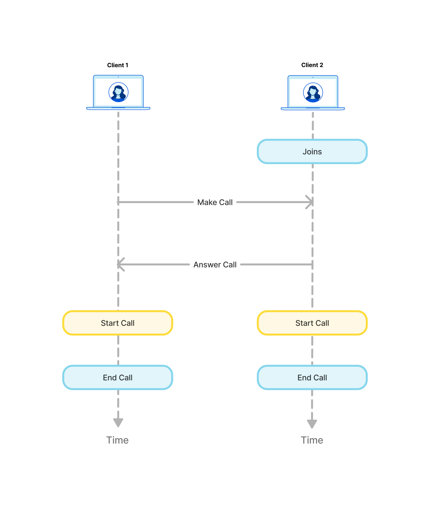

# Veet

A video call app built on a single [Cloudflare Worker](https://developers.cloudflare.com/workers/), combining [static assets](https://developers.cloudflare.com/workers/static-assets/) and [Durable Objects](https://developers.cloudflare.com/durable-objects/).

## Video tutorials

- [Build a Video Call App with Durable Objects](https://www.youtube.com/playlist?list=PLzfTyn6__SjgC2ty1_BAl0RGgr2jKjngz)

> The series was recorded when Veet was split across a Pages project and a separate
> signalling Worker. It is now a single Worker, so the project layout differs from
> the videos.

## How It Works


Peer to peer connection for video and audio stream is delivered over [WebRTC](https://developer.mozilla.org/en-US/docs/Web/API/WebRTC_API). Peer discovery and signalling is powered by [WebSockets](https://developer.mozilla.org/en-US/docs/Web/API/WebSocket) over [Durable Objects](https://developers.cloudflare.com/durable-objects/api/websockets/).

The diagram below explains how signalling over WebSocket happens on the frontend


One Worker serves the whole app:

| Request              | Handled by                                            |
| -------------------- | ----------------------------------------------------- |
| `/ws/<meeting-id>`   | A Durable Object, one instance per meeting            |
| `/ice`               | The Worker, minting short-lived TURN credentials      |
| everything else      | Static assets in [`public/`](./public)                |

Because the frontend and the signalling endpoint share an origin, the client derives
its WebSocket URL from `location` — there is no backend address to configure.

## Local setup

Clone the repo and install dependencies

```sh
git clone https://github.com/megaconfidence/veet.git
cd veet
npm i
```

Start a local dev server

```sh
npm start #available on http://localhost:8787
```

Open the same meeting link in two tabs to place a call.

## TURN credentials

Without a TURN key the app falls back to STUN only, which is fine locally and on most
home networks, but fails behind symmetric NAT and restrictive firewalls. To enable TURN,
create a key on the [Cloudflare Realtime dashboard](https://dash.cloudflare.com/?to=/:account/calls)
and set both values as secrets

```sh
npx wrangler secret put TURN_KEY_ID
npx wrangler secret put TURN_KEY_API_TOKEN
```

For local development, put the same values in a `.dev.vars` file (already gitignored)

```ini
TURN_KEY_ID="..."
TURN_KEY_API_TOKEN="..."
```

The long-term key stays on the server. `/ice` exchanges it for credentials that expire
after two hours.

## Deploy

```sh
npm run deploy
```
